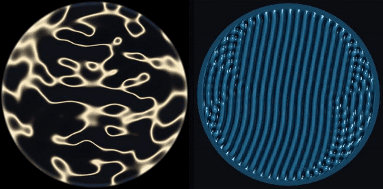

# Vibración 🌊

> Play music, watch the pattern the water forms. Chladni eigenmodes and a Faraday wave solver, both running in the browser.

<div align="center">
  

  <p>
    <a href="https://luisreinoso.dev/vibracion/">
      
    </a>
    
    
    
  </p>
</div>

Two simulations run side by side, because cymatics videos routinely conflate two different phenomena.

**Chladni figures** are a dry plate: powder sprinkled on a vibrating surface migrates to the nodal lines and stays there. **Faraday waves** are actual liquid: a vertically shaken fluid layer whose surface goes unstable and responds at *half* the driving frequency.

Everything runs client side. No build step, no server, no dependencies at runtime.

## A · Chladni eigenmodes

Real eigenmodes, solved rather than faked:

- **Circular dish** (membrane): `u(r,θ) = J_n(α_nm · r/R) · cos(nθ + φ)`, with `α_nm` the m-th zero of the Bessel function `J_n`. Frequencies follow `f_nm / f_01 = α_nm / α_01`.
- **Square plate**, classic free-edge approximation: `u = cos(nπx)cos(mπy) ± cos(mπx)cos(nπy)`, with `f ∝ √(n²+m²)`.

Each mode is excited by the audio spectrum filtered through a Lorentzian centred on its eigenfrequency, which is the response of a driven damped oscillator. The Q slider controls how narrow that resonance is: high Q means a very selective plate that only answers to near-exact frequencies.

Bessel zeros are computed numerically at startup (bisection over sign changes) and uploaded to the GPU as a lookup table, so the shader evaluates `J_n` with a texture read.

The **Water (antinodes)** toggle inverts the accumulation rule: light powder goes to the nodes, but a heavy liquid does the opposite and gathers where the plate slams hardest.

## B · Faraday waves

No precomputed modes here. This is a PDE solver on a 256×256 grid on the GPU, ping-ponging between floating-point framebuffers.

```
dh/dt = -H · ∇²φ
dφ/dt = -g(t)·h + S·∇²h + (1 + β h²)·(ν·∇²φ - γ·φ)
g(t)  = g₀ · (1 + F·cos Ωt)
```

Linearised shallow-water free surface with capillarity, plus a cubic saturation term so the instability does not grow without bound. Dispersion is `ω(k)² = H(g₀k² + S k⁴)`.

The interesting part is the oscillating effective gravity. With `g(t)` periodic every mode obeys a Mathieu equation, and the dominant instability tongue is the **subharmonic** one: water responds at `Ω/2`, not `Ω`. Shake a container at 40 Hz and the surface ripples at 20. That is the Faraday signature, and it falls out of the solver rather than being hard-coded.

Since `ω(k)` grows with `k`, raising the pitch selects a larger wavenumber and the pattern gets finer. The panel reports the selected wavelength and the threshold `F_c = 2(γ + νk²)/ω`: below it the surface stays flat no matter how far you turn the volume up, exactly as in a real experiment.

The `ν∇²φ` term is viscous dissipation and it is not decorative. It damps at rate `νk²`, hitting short waves far harder. Without it the threshold would *fall* as `k` rises, grid-scale modes would always win, and the result would be numerical noise wearing the costume of physics.

Three numerical details that change the result, not just the speed:

The Laplacian is the isotropic 9-point stencil (2/3 on edges, 1/6 on corners). With the 5-point stencil the stripes glue themselves to the grid axes and 45° staircases appear, which is scheme anisotropy rather than a direction the fluid picked.

The wall is an absorbing layer about eight cells wide, not a hard boundary. A circular edge on a Cartesian grid is a staircase of pixels: it reflects short waves and fills the rim with speckle.

Integration is symplectic Euler, two passes per substep and 24 substeps per frame. The substep count matters because the instability needs tens of simulation time units to grow out of the noise; with too few, the pattern never forms before the music changes pitch and detunes the resonance.

## The singing bowl

The best of the three sources, and synthesised rather than sampled: a sample runs out before the Faraday pattern finishes emerging, and this way the bowl size can be changed while it rings.

A singing bowl is an axisymmetric bell vibrating in flexural modes with *m* nodal diameters: m=2 gives four sectors, m=3 gives six. For a thin ring the theory gives `f_m ∝ m(m²−1)/√(m²+1)`, that is 1 : 2.83 : 5.42 : 8.77. A bowl is not a ring and departs somewhat, so the ratios used are the ones measured by Inácio, Henrique and Antunes in *The dynamics of Tibetan singing bowls* (Acta Acustica, 2006): **1 : 2.77 : 5.18 : 8.12 : 11.53**.

What makes the bowl special here is that those partials are **inharmonic**. They are not integer multiples of the fundamental, so they excite unrelated plate eigenmodes and the resulting figure looks nothing like a string playing the same note. They are also sustained and free of attack transients, so Ω holds still and the instability grows without detuning.

The beating is modelled too. No bowl is perfectly round, and that asymmetry splits each mode into two with nearly equal frequencies. Together they produce the slow warble that identifies the instrument, and in the water it shows up as the pattern breathing: the drive swings between roughly 3× and 5× threshold in time with the beat.

Rubbing and striking are different excitations and are modelled as such. Rubbing is stick-slip: it is born and grows, and loads mostly the fundamental. Striking spreads energy across every mode at once, each with its own decay, and the high partials die long before the fundamental.

## From audio to simulation

Two details of the bridge between music and physics that are not obvious, and without which the program only works on laboratory tones.

**Omega follows the spectral centroid, not the loudest bin.** In real music the highest-amplitude bin jumps from kick drum to cymbal between one frame and the next. If Omega chases that jump the parametric drive never accumulates coherent phase and the surface stays flat however far above threshold the forcing is. The centroid, the amplitude-weighted mean of the spectrum, moves slowly and is also the standard measure of brightness.

**The level goes through automatic gain control.** Absolute level depends on how the track was mastered, and a mix spreads its energy over hundreds of bins while a pure tone concentrates it in one. Without normalising, an ordinary song sits below the Faraday threshold. The reference tracks the peak with fast attack and slow decay, so it decays on its own in silence and the water settles.

**The drive has a floor while anything is playing.** This is the one place where the program departs from physics for the sake of the show, so it is worth saying plainly. Without a floor, a quiet passage takes the drive below threshold, the pattern dissolves, and regrowing from noise costs tens of seconds, far longer than the passage lasts. The result was a flat dish for most of a track even though every individual instant was correct. With a floor, the music modulates amplitude and wavelength instead of switching the instability on and off. A gate still closes the drive completely when there is genuinely no signal, so stopping the music settles the water.

The pattern takes ten to thirty seconds to emerge from noise. That is exponential growth from a tiny amplitude, not a fade-in: it can be accelerated by raising the drive gain, at the cost of a more chaotic pattern.

## Why the water did not look like the videos

Cymatics videos show squares and ordered lattices. The shallow-water solver above produces labyrinths in every regime. There are three reasons and only two of them are physics.

**The nonlinear term can only make stripes.** In the amplitude equation of Chen and Viñals ([Phys. Rev. E 60, 559](https://doi.org/10.1103/PhysRevE.60.559), 1999),

```
dB_n/dT = αB_n − g₀B_n³ − Σ g(θ_mn)·B_m²·B_n
```

the thing that decides the shape is `g(θ)`, the coupling between two waves whose vectors meet at angle θ. A local cubic saturation gives a constant `g(θ)`, and with cross-coupling above self-coupling a single direction always wins. Verified by taking the solver to the exact regime where Binks and van de Water observed hexagons: stripes came out.

**And it was in the wrong regime.** The Chen–Viñals map: γ~1 gives stripes; γ≪1 with capillarity gives squares; γ≪1 in the mixed regime gives hexagons and quasipatterns; γ≪1 in pure gravity gives stripes again. Using the formula from Terwagne and Bush ([Nonlinearity 24, R01](https://doi.org/10.1088/0951-7715/24/8/R01), 2011), `λ_F = (2π)^⅓(σ/ρ)^⅓(f₀/2)^-⅔`, water at 100 Hz has λ = 5.7 mm and Bond number 0.11: **capillary**. Below 1.7 cm of wavelength, surface tension rules. The shallow-water solver was running at Bond = 41, the opposite corner.

**The videos also use a synchronised camera.** Faraday responds at f/2; filming at the right frequency freezes the pattern. To the naked eye you would see a blur. And they use small dishes holding few wavelengths, which gives discrete container modes rather than an extended pattern.

## C · Zakharov, the real nonlinearity

`js/zakharov.js` solves the potential formulation with the Dirichlet-Neumann operator expanded after Craig and Sulem (J. Comp. Phys. 108, 73, 1993):

```
dη/dt = G(η)ψ + 2ν∇²η
dψ/dt = -g(t)η + σκ(η) - |∇ψ|²/2 + (G(η)ψ + ∇η·∇ψ)²/(2(1+|∇η|²)) + 2ν∇²ψ

G₀    = |k| tanh(|k|h)
G₁(η) = D·ηD - G₀ηG₀
G₂(η) = -½(G₀η²D² + D²η²G₀ - 2G₀ηG₀ηG₀)
```

κ is the exact curvature, untruncated. The state lives in Fourier space, which makes dispersion, linear capillarity and dissipation exact multipliers and leaves only one nonlinear evaluation per step. Twelve transforms per step, using an in-house GPU FFT (Stockham autosort, `js/fft.js`), with products dealiased by the two-thirds rule.

Put in the capillary regime at γ=0.007 it **selects squares**: the 90° angular harmonic reaches 0.99 against 0.42 for stripes. In gravity it does not, which is the control that gives the result meaning.

Switch it on with the **Faithful water** button in panel B. It is considerably more expensive than the fast engine and takes ten seconds or so to form a pattern.

## Validation against a real experiment

Everything above compares the solver against the theory of the model the solver implements. That shows the code solves its equations correctly, not that those equations are water. This section is the other thing.

**Binks and van de Water** (Phys. Rev. Lett. 78, 4043, 1997) measured pattern selection in silicone oil with ν=0.03397 cm²/s, ρ=0.8924 g/cm³ and σ=18.3 dyn/cm, in a large aspect-ratio cell far deeper than the wavelength. They observed squares above 41 Hz, stable hexagons towards 36 Hz and a mixed band in between. Chen and Viñals put the transition at 35.4 Hz.

`js/units.js` converts that fluid into solver units. The only inputs are the three fluid properties and the drive frequency: **nothing is fitted**. The length scale is chosen by asking the wavelength to span ten cells at 38 Hz, giving a 22.7 cm box on a 256 grid, and the time scale by asking dimensionless gravity to equal one.

Sweep at 1.8× threshold, 100,000 transient steps and an average over the next 80,000:

| f₀ (Hz) | Σ | γ | stripes | squares | hexagons | |
|---|---|---|---|---|---|---|
| 28 | 0.35 | 0.020 | 0.14 | 0.15 | **0.79** | hexagons |
| 32 | 0.42 | 0.024 | 0.14 | 0.26 | **0.93** | hexagons |
| 36 | 0.49 | 0.027 | 0.10 | 0.12 | **0.96** | hexagons |
| 38 | 0.51 | 0.029 | 0.15 | **0.90** | 0.37 | mixed |
| 40 | 0.54 | 0.030 | 0.03 | **0.95** | 0.02 | squares |
| 44 | 0.58 | 0.033 | 0.11 | **0.96** | 0.18 | squares |
| 48 | 0.62 | 0.035 | 0.15 | **0.93** | 0.37 | squares |

The transition lands **between 36 and 38 Hz**, with 38 Hz showing squares dominant but a clear hexagonal component, which is the mixed band. The laboratory puts it towards 36 Hz with mixing up to 41. Chen and Viñals, at 35.4.

The sweep's γ values run from 0.020 to 0.035, inside the 0.01–0.03 range those authors quote for this experiment, confirming the unit conversion places the simulation where the experiment was and not somewhere else.

### Two things that nearly ruined the measurement

**The transient lies.** Amplitude saturates long before the symmetry is decided. At 30 Hz the system passes through a phase with squares dominant (n₂ = 0.60 around 90,000 steps) and only later do hexagons displace them and stay. Measuring early gives the opposite answer, with full confidence and no symptom that anything is wrong.

**The grid biases.** A square grid has exact modes on its axes, orthogonal by construction, while three directions at 60° almost never land on grid points. At 128 cells the resonant ring holds around 70 directions and the bias is enough to mask hexagons. At 256 it holds over 700 and the bias disappears.

### Convergence

Repeating with the time step halved, same physical time:

| f₀ | dt | stripes | squares | hexagons | |
|---|---|---|---|---|---|
| 32 Hz | 0.02 | 0.143 | 0.256 | **0.927** | hexagons |
| 32 Hz | 0.01 | 0.117 | 0.231 | **0.922** | hexagons |
| 44 Hz | 0.02 | 0.111 | **0.963** | 0.178 | squares |
| 44 Hz | 0.01 | 0.234 | **0.997** | 0.268 | squares |

The selected symmetry does not change and the dominant harmonics move by under 4%. The result is not an artefact of the time step.

### What remains unvalidated

Dissipation is still phenomenological and does not resolve the boundary layer. The flow is potential, so there is no vorticity, and real Faraday waves generate it ([Phys. Rev. X 4, 021021](https://doi.org/10.1103/PhysRevX.4.021021), 2014). The domain is periodic: no walls, no meniscus, no contact line. And the operator is truncated at cubic order, so no wave breaking and no droplets.

With that said: the symmetry transition lands where it was measured, without fitting a single parameter.

## Scale: the honest part

Panel B is dimensionless by default. Real water at 440 Hz would produce capillary ripples of a fraction of a millimetre, invisible on screen. The Ω sliders set the range the 40 Hz – 6 kHz audio band is mapped onto logarithmically. Adjust them until the pattern is a size you can see.

In panel A the relationship is exact except for `f₀`, the plate's fundamental, which you choose. A laboratory Chladni plate usually sits between 80 and 200 Hz.

## Usage

Serve `index.html` from any static server. ES modules will not load from `file://`.

```
npm start
```

Then open `http://localhost:8777`. Two public-domain tracks and a synthesised singing bowl ship with it, so there is nothing to download to try it (see `audio/CREDITS.md`).

### Simple and expert mode

By default the interface offers four decisions: what plays, what is shown, round or square, and how much detail. The button in the top right reveals the full physics: plate fundamental, Q, surface tension, viscosity, drive gain and Ω range. The choice is remembered between sessions.

The detail knob does not bypass the expert sliders, it writes into them, so the two modes never disagree. Fine means low f₀, so a given note excites high-order modes, and high Ω, so the subharmonic resonance selects a larger wavenumber.

The ⤢ button on each panel goes fullscreen with no header or text and raises the canvas resolution to match the display. That is what screen recording needs.

Quick tour:

- **Singing bowl** is the most striking source and the fastest to form a pattern. Drag the bowl size while it rings and watch the figure sharpen.
- **Pure tone** plus the frequency slider is the best way to understand what each part does. Move it slowly and watch the Chladni figure jump from one mode to the next.
- **Sweep 50→2000 Hz** walks the spectrum in 24 seconds and shows the full mode sequence.
- **Lock Ω** freezes the Faraday drive so the pattern can settle without the audio moving it.
- **Microphone** is not routed to the speakers, to avoid feedback.

If the water stays flat, check the `F_c` line in panel B: you are below threshold. Raise the volume, raise the drive gain or lower the viscosity. If instead it looks grainy and chaotic you are too far above threshold: lower the gain. The interesting band runs from 2× to 5×.

`window.vibracion` exposes the audio engine and both simulations from the console.

## Tests

```
npm install
npx playwright install chromium
npm test                # normal suite, no GPU needed
npm run test:slow       # adds pattern selection, about 6 minutes
npm run test:validation # the experiment validation, needs a GPU
```

Thirty-eight end-to-end tests with Playwright, around eight minutes. The physics tests do not check that the program still returns what it returned yesterday; they compare against values that exist outside the code.

Bessel zeros against Abramowitz and Stegun table 9.5. Pattern wavelength measured with a radial DFT over the height field and compared against the Mathieu prediction. Subharmonic response measured by counting zero crossings of the water against zero crossings of the drive, which has to come out at one half. Below threshold, the surface is required to stay flat. And after minutes of simulation, no NaN and cubic saturation braking before the hard clamp.

The last command opens a real window on purpose. The headless runner starts Chromium with SwiftShader, i.e. software rendering, and this validation runs twelve Fourier transforms per step on a 256 grid for tens of thousands of steps: under software it does not finish in half an hour, against under two minutes on a GPU. That is why it stays out of CI.

Seven of the tests are regressions for bugs that actually happened: the whole page vanished on entering expert mode; the water ignored real music while responding to pure tones; the pattern dissolved in every quiet passage and took longer to regrow than the passage lasted; the water kept moving after playback stopped; the `hidden` attribute hid nothing because a local `display` rule beat the browser's; and the tests poisoned each other by piling up WebGL contexts.

That last one deserves a note, because it does not fail where it is caused. A browser keeps only a handful of WebGL contexts alive; past that it discards the oldest, and from then on their reads **silently return zeros**. Since tests run serially in one browser, the file that abandons contexts does not fail: it makes the following files fail. Fixed with an `afterEach` calling `loseContext()` on everything registered.

## Deploying to GitHub Pages

The site is static, no build. Push and enable Pages.

Via the UI: Settings → Pages → Source: *Deploy from a branch* → `main`, folder `/ (root)`.

Or with the workflow already in `.github/workflows/pages.yml`: Settings → Pages → Source: *GitHub Actions*. It runs the tests before deploying, so a physics regression blocks publication.

The `.nojekyll` file is there so Jekyll leaves `js/` alone.

## Requirements

WebGL2 with `EXT_color_buffer_float` (or `EXT_color_buffer_half_float`) and the Web Audio API. Any recent Chrome, Firefox, Edge or Safari.

## Layout

```
index.html
css/style.css
js/app.js            wiring, UI, simple/expert mode, spectrum
js/audio.js          FFT, centroid, gain control, per-mode resonant energy
js/chladni.js        eigenmodes plus the plate shader
js/faraday.js        fast shallow-water GPU solver
js/zakharov.js       Zakharov solver with the real nonlinearity
js/faithful-view.js  panel for the faithful solver
js/fft.js            complex 2D FFT on the GPU (Stockham)
js/units.js          bridge between a real fluid and solver units
js/singing-bowl.js   modal synthesis of the singing bowl
js/bessel.js         J_n, zeros, GPU lookup table
js/glutil.js         WebGL2 helpers
audio/               two public-domain tracks plus credits
tests/               Playwright suite
```

## References

- P. Chen and J. Viñals, *Amplitude equations and pattern selection in Faraday waves*, Phys. Rev. E **60**, 559 (1999).
- B. J. Binks and W. van de Water, *Nonlinear pattern formation of Faraday waves*, Phys. Rev. Lett. **78**, 4043 (1997).
- D. Terwagne and J. W. M. Bush, *Tibetan singing bowls*, Nonlinearity **24**, R51 (2011).
- W. Craig and C. Sulem, *Numerical simulation of gravity waves*, J. Comp. Phys. **108**, 73 (1993).
- O. Inácio, L. Henrique and J. Antunes, *The dynamics of Tibetan singing bowls*, Acta Acustica **92** (2006).

## Licence

MIT, except the bundled audio, which is public domain. See `LICENSE` and `audio/CREDITS.md`.
